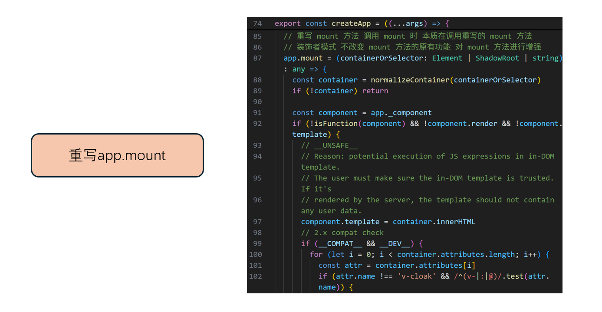
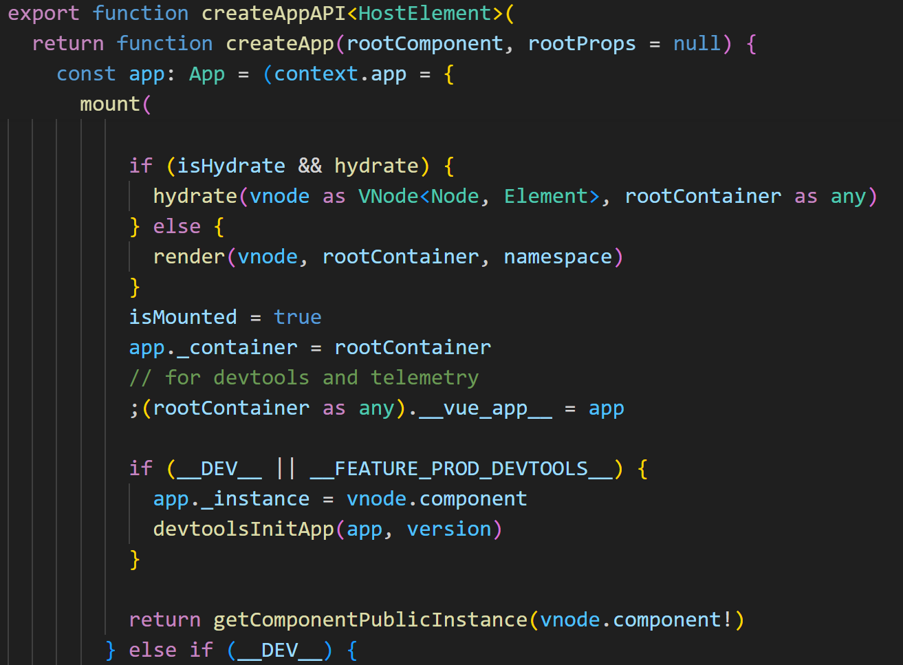
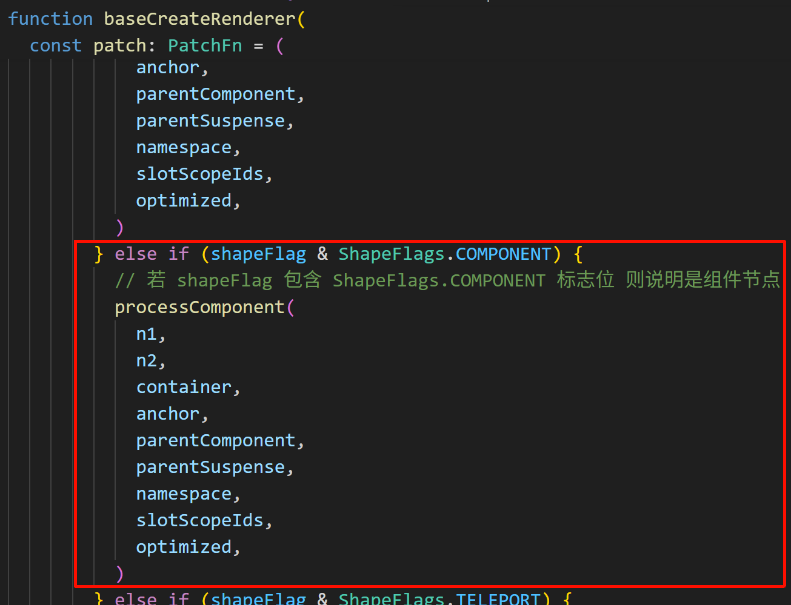
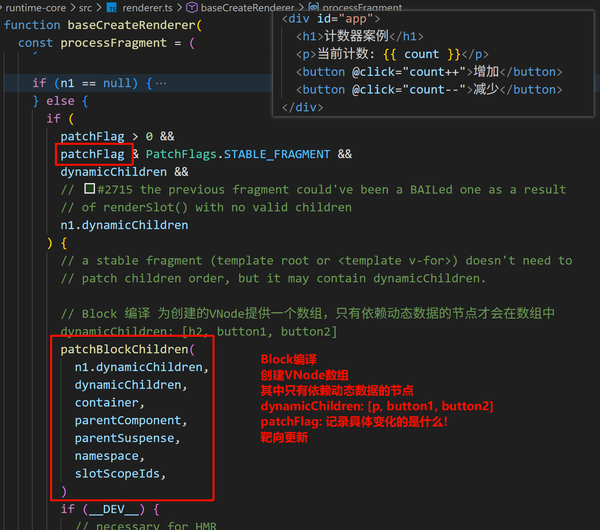
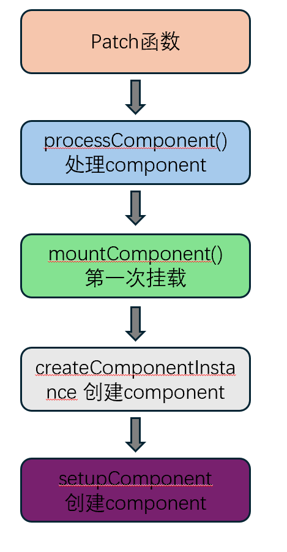
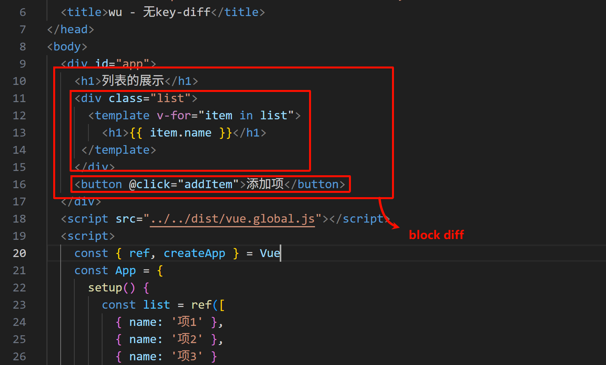

# Vue3-源码分析

> version：3.4.33

### 一. 源码下载⬇️、打包、调试

[vuejs/core: 🖖 Vue.js is a progressive, incrementally-adoptable JavaScript framework for building UI on the web.](https://github.com/vuejs/core)

```sh
# 安装依赖
pnpm install
pnpm run dev
# 输出内容
> built: packages\vue\dist\vue.global.js
```

其后在`packages/vue/example`文件夹中创建自己的调试文件夹进行调试


测试代码案例如下

```html
<!DOCTYPE html>
<html lang="en">
<head>
  <meta charset="UTF-8">
  <meta name="viewport" content="width=device-width, initial-scale=1.0">
  <title>test</title>
</head>
<body>
  <div id="app">
    <h1>计数器案例</h1>
    <p>当前计数: {{ count }}</p>
    <button @click="count++">增加</button>
    <button @click="count--">减少</button>
  </div>
</body>

<script src="../../dist/vue.global.js"></script>

<script>
  const { ref, createApp } = Vue
  const App = {
    setup() {
      const count = ref(0)
      function increment() {
        count.value++
      }
      function decrement() {
        count.value--
      }
      return {
        count,
        increment,
        decrement
      }
    }
  }
  createApp(App).mount('#app')
</script>

</html>
```

---

### 二. Vue3的整体架构


---

### 三. Vue3源码分析

#### 1. 😊 createVNode 的过程 (h函数的本质)

🐴小马口述总流程: 

- h函数 -> createVNode -> _createVNode -> createBaseVNode -> 创建Vnode对象


---

#### 2. 😊 createApp(app).mount('#app') 的过程

🐴小马口述总流程: 

- 通过ensureRenderer()函数实例化渲染器，调用渲染器中的createApp(...args)方法获得 app 对象。并在其中拓展app中的mount方法，返回app；.mount('#app')调用拓展的mount()方法。

- ensureRenderer() 则会调用createRenderer()继而调用baseCreateRenderer()来创建渲染器

  

- createApp() 即渲染器baseCreateRenderer() 返回的createApp -> createAppAPI(render,hydrate)('#app')中返回app实例(柯里化)

  

- 调用 .mount('#app') 挂载到目标渲染对象，调用render()函数进行渲染

  

---

#### 3. 😊 diff 算法

##### 1.🙇 认识diff 算法

- **diff 算法是 Vue 等现代前端框架用来优化 DOM 更新的核心技术。它完成了如下工作：**
  - 它的基本原理是通过前后两个虚拟 DOM 树(VNode 树) 来找出最小的差异，然后仅对这些差异部分进行更新，而不是重新渲染整个DOM 树
  - 每次状态更新时，框架会生成新的虚拟 DOM 树，框架将新的虚拟 DOM 树与旧的虚拟 DOM 树进行比较，找出不同之处。
  - 根据 diff 结果，框架只会更新那些发生变化的 DOM 节点，而不会影响未变化的部分
- **diff 算法 通过以下几种方式来提高性能：**
  - **避免不必要的DOM更新**：通过比较新旧虚拟DOM树，diff算法只更新需要变更的部分。这避免了重新构建整个DOM树的开销，减少了不必要的重绘和重排，提升了渲染效率。
  - **局部更新**：Diff算法会智能地识别哪些部分需要更新，并通过 patching(打补丁) 的方式仅更新这些部分。这种局部更新策略极大地减少了DOM操作的次数。
  - **更高效的节点处理**：Diff算法通常使用一些优化技术，比如 Vue3 中的最长递增子序列(LIS) 算法，来减少节点的移动操作次数。这使得即使在复杂的列表或节点结构中，DOM更新也能保持高效。
  - **静态内容优化**：通过在编译阶段识别静态内容，diff算法能够在更新时跳过这些静态内容的比较，进一步减少计算和更新的开销。

##### 2. 🙇 diff 算法 Block块优化及其之前的过程

🐴小马口述总流程: 

- 🙂‍↕️ 根据createApp(app).mount('#app') 流程可知，mount 方法通过render函数实现视图渲染render函数内进行patch操作进而实现diff对比。

  

- 🙂‍↕️ createApp(app).mount('#app') 调用的render函数进而调用patch()为首次调用，且传入app为组件，故走processComponent 分支对组件进行处理

  

- processComponent 中调用mountComponent(/updateComponent)，而在mountComponent中会调用setupRenderEffect进行渲染

- 🙂‍↕️ **setupRenderEffect**

  - 一句话口述: setupRenderEffect = 创建组件的更新函数，负责：首次挂载渲染 + 后续更新渲染

  - ```typescript
    setupRenderEffect() {
      定义 componentUpdateFn() {
        if (!isMounted) {
          第一次 → 执行【挂载逻辑】
        } else {
          已挂载 → 执行【更新逻辑】
        }
      }
    
      将 componentUpdateFn 变成响应式 effect
      并立即执行一次 → 首次渲染
    }
    ```

  - 首次挂载

    ```typescript
    if (!instance.isMounted) {
      // 1. 触发 beforeMount
      invokeArrayFns(bm)
    
      // 2. 渲染组件生成 subTree（执行 render / template 编译的函数）
      const subTree = renderComponentRoot(instance)
    
      // 3. 把 subTree 变成真实 DOM
      patch(null, subTree, container, ...)
    
      // 4. 记录真实 DOM
      initialVNode.el = subTree.el
    
      // 5. 触发 mounted
      queuePostRenderEffect(m)
    
      // 标记已挂载
      instance.isMounted = true
    }
    ```

  - 更新逻辑

    ```typescript
    } else {
      // 1. 触发 beforeUpdate
      invokeArrayFns(bu)
    
      // 2. 重新渲染生成新 VNode
      const nextTree = renderComponentRoot(instance)
    
      // 3. diff + 更新 DOM
      patch(prevTree, nextTree, ...)
    
      // 4. 触发 updated
      queuePostRenderEffect(u)
    }
    ```

  - diff算法在patch函数中进行，上方为component组件的patch过程，二次patch面对多根、template则会执行processFragment()函数

- 🙂‍↕️ **processFragment**

  - 一句话口述: Fragment = 无标签虚拟容器，用两个文本节点（空文本）当 “开头锚点 + 结尾锚点”，直接把子节点插在中间，自己不生成任何标签

  - 创建虚拟锚点

    ```typescript
    const fragmentStartAnchor = (n2.el = n1 ? n1.el : hostCreateText(''))!
    const fragmentEndAnchor = (n2.anchor = n1 ? n1.anchor : hostCreateText(''))!
    ```

  - 首次挂载(n1 === null)

    ```typescript
    if (n1 == null) {
      // 插入开头锚点
      hostInsert(fragmentStartAnchor, container, anchor)
      // 插入结尾锚点
      hostInsert(fragmentEndAnchor, container, anchor)
    
      // 挂载子节点到两个锚点中间！
      mountChildren(
        n2.children as VNodeArrayChildren,
        container,
        fragmentEndAnchor, // ← 插到结尾锚点前面
        parentComponent,
        ...
      )
    }
    ```

  - 更新逻辑

    ```typescript
    else {
      if (稳定片段 + 有动态子节点) {
        // 只更新动态节点（性能优化）
        patchBlockChildren(...)
      } else {
        // 全量 diff 更新
        patchChildren(...)
      }
    }
    ```

  - 重点: patchBlockChildren() 函数，只处理动态节点，相对Vue2有很大的优化

    

- ❤️ tips

  - **processFragment**：处理**无 DOM 的虚拟片段**（多根、template）
  - **processComponent**：处理**Vue 组件**（setup、data、生命周期…）
  - **processElement**：处理**HTML 标签**（div/span）

- ⁉️ patch 流程

  一图说明总流程

  

- ⁉️ 疑惑 mountComponent是如何将组件挂载到视图中的呢?

  

##### 3. 🙇 无key-diff 算法

🐴小马口述总流程: 

- 🙂‍↕️ 测试代码

  ```html
  <!DOCTYPE html>
  <html lang="en">
  <head>
    <meta charset="UTF-8">
    <meta name="viewport" content="width=device-width, initial-scale=1.0">
    <title>无key-diff</title>
  </head>
  <body>
    <div id="app">
      <h1>列表的展示</h1>
      <div class="list">
        <template v-for="item in list">
          <h1>{{ item.name }}</h1>
       </template>
      </div>
      <button @click="addItem">添加项</button>
    </div>
    <script src="../../dist/vue.global.js"></script>
    <script>
      const { ref, createApp } = Vue
      const App = {
        setup() {
          const list = ref([
            { name: '项1' },
            { name: '项2' },
            { name: '项3' }
          ])
          function addItem() {
            list.value.push({ name: `项${list.value.length + 1}` })
          }
          return {
            list,
            addItem,
          }
        }
      }
      createApp(App).mount('#app')
    </script>
  </body>
  </html>
  ```

  

- 🙂‍↕️ 这块diff算法在list-fragment层内部，不再是fragment，非动态子节点，则执行patchChildren(...)进行更新，正如processFragment函数所示

  processFragment更新逻辑

  ```typescript
  else {
    if (稳定片段 + 有动态子节点) {
      // 只更新动态节点（性能优化）
      patchBlockChildren(...)
    } else {
      // 全量 diff 更新
      patchChildren(...)
    }
  }
  ```

- 🙂‍↕️ **patchChildren**

  - 一句话总结: patchChildren = 根据子节点类型，选择最合适的方式更新子节点；它只干一件事：**判断旧子节点 + 新子节点是什么类型 → 调用对应方法**

    ```typescript
    patchChildren() {
      1. 先看有没有编译优化标记（patchFlag）
         → 有 KEYED_FRAGMENT → 走【带key的diff】
         → 有 UNKEYED_FRAGMENT → 走【不带key的diff】
    
      2. 没有优化标记 → 走通用判断
         → 新节点是【文本】→ 直接替换文本
         → 新老都是【数组】→ 全量diff（带key）
         → 旧数组、新空 → 卸载旧节点
         → 旧文本、新数组 → 清空文本，挂载新数组
    }
    ```

  - 优先走编译优化

    ```typescript
    if (patchFlag > 0) {
      if (patchFlag & PatchFlags.KEYED_FRAGMENT) {
        patchKeyedChildren(...) // 带 key 的列表 diff（最常用）
        return
      } else if (patchFlag & PatchFlags.UNKEYED_FRAGMENT) {
        patchUnkeyedChildren(...) // 不带 key 的列表 diff
        return
      }
    }
    ```

    v-for 走的逻辑

    写了 `key` → `patchKeyedChildren`（高性能 diff）

    没写 `key` → `patchUnkeyedChildren`（简单复用）

  - 新子节点是【文本】或【数组】

    ```typescript
    // prev children was text OR null
    // new children is array OR null
    if (prevShapeFlag & ShapeFlags.TEXT_CHILDREN) {
    // 文本节点 清空文本内容
    hostSetElementText(container, '')
    }
    // mount new if array
    if (shapeFlag & ShapeFlags.ARRAY_CHILDREN) {
    // 新子节点是数组节点
    mountChildren(
    c2 as VNodeArrayChildren,
    container,
    anchor,
    parentComponent,
    parentSuspense,
    namespace,
    slotScopeIds,
    optimized,
    )
    }
    ```

- 🙂‍↕️ **patchUnkeyedChildren**

  - 无key 情况下，会调用patchUnkeyedChildren方法对其内部元素进行处理，接下来我们去看patchUnkeyedChildren方法

  - 一句话总结: 只按 “下标” 一对一 patch，相同位置能复用就复用，不能就删 / 增，完全不识别节点是否移动！

  - 准备工作

    ```typescript
    c1 = c1 || EMPTY_ARR  // 旧子节点
    c2 = c2 || EMPTY_ARR  // 新子节点
    const oldLength = c1.length
    const newLength = c2.length
    const commonLength = Math.min(oldLength, newLength) // 取短的那个长度
    ```

  - 核心逻辑(按下标一对一patch)

    ```typescript
    for (i = 0; i < commonLength; i++) {
      const nextChild = normalizeVNode(c2[i])
      patch(
        c1[i],  // 旧节点【下标i】
        nextChild, // 新节点【下标i】
        container,
        ...
      )
    }
    ```

  - 旧的比新的多 -> 删除多余

    ```typescript
    if (oldLength > newLength) {
      unmountChildren(c1, ..., commonLength)
    }
    ```

  - 新的比旧的多 -> 新增挂载

    ```typescript
    else {
      mountChildren(c2, ..., commonLength)
    }
    ```

- 🙂‍↕️ 
