# Vue3-源码分析

> version：3.4.33

### 一. 源码下载⬇️、打包、调试

[vuejs/core: 🖖 Vue.js is a progressive, incrementally-adoptable JavaScript framework for building UI on the web.](https://github.com/vuejs/core)

```sh
# 安装依赖
pnpm install
pnpm run dev
# 输出内容
> built: packages\vue\dist\vue.global.js
```

其后在`packages/vue/example`文件夹中创建自己的调试文件夹进行调试


测试代码案例如下

```html
<!DOCTYPE html>
<html lang="en">
<head>
  <meta charset="UTF-8">
  <meta name="viewport" content="width=device-width, initial-scale=1.0">
  <title>test</title>
</head>
<body>
  <div id="app">
    <h1>计数器案例</h1>
    <p>当前计数: {{ count }}</p>
    <button @click="count++">增加</button>
    <button @click="count--">减少</button>
  </div>
</body>

<script src="../../dist/vue.global.js"></script>

<script>
  const { ref, createApp } = Vue
  const App = {
    setup() {
      const count = ref(0)
      function increment() {
        count.value++
      }
      function decrement() {
        count.value--
      }
      return {
        count,
        increment,
        decrement
      }
    }
  }
  createApp(App).mount('#app')
</script>

</html>
```

---

### 二. Vue3的整体架构


---

### 三. Vue3源码分析

#### 1. 😊 createVNode 的过程 (h函数的本质)

🐴小马口述总流程: 

- h函数 -> createVNode -> _createVNode -> createBaseVNode -> 创建Vnode对象


---

#### 2. 😊 createApp(app).mount('#app') 的过程

🐴小马口述总流程: 

- 通过ensureRenderer()函数实例化渲染器，调用渲染器中的createApp(...args)方法获得 app 对象。并在其中拓展app中的mount方法，返回app；.mount('#app')调用拓展的mount()方法。

- ensureRenderer() 则会调用createRenderer()继而调用baseCreateRenderer()来创建渲染器

  

- createApp() 即渲染器baseCreateRenderer() 返回的createApp -> createAppAPI(render,hydrate)('#app')中返回app实例(柯里化)

  

- 调用 .mount('#app') 挂载到目标渲染对象，调用render()函数进行渲染

  

---

#### 3. 😊 diff 算法

##### 1.🙇 认识diff 算法

- **diff 算法是 Vue 等现代前端框架用来优化 DOM 更新的核心技术。它完成了如下工作：**
  - 它的基本原理是通过前后两个虚拟 DOM 树(VNode 树) 来找出最小的差异，然后仅对这些差异部分进行更新，而不是重新渲染整个DOM 树
  - 每次状态更新时，框架会生成新的虚拟 DOM 树，框架将新的虚拟 DOM 树与旧的虚拟 DOM 树进行比较，找出不同之处。
  - 根据 diff 结果，框架只会更新那些发生变化的 DOM 节点，而不会影响未变化的部分
- **diff 算法 通过以下几种方式来提高性能：**
  - **避免不必要的DOM更新**：通过比较新旧虚拟DOM树，diff算法只更新需要变更的部分。这避免了重新构建整个DOM树的开销，减少了不必要的重绘和重排，提升了渲染效率。
  - **局部更新**：Diff算法会智能地识别哪些部分需要更新，并通过 patching(打补丁) 的方式仅更新这些部分。这种局部更新策略极大地减少了DOM操作的次数。
  - **更高效的节点处理**：Diff算法通常使用一些优化技术，比如 Vue3 中的最长递增子序列(LIS) 算法，来减少节点的移动操作次数。这使得即使在复杂的列表或节点结构中，DOM更新也能保持高效。
  - **静态内容优化**：通过在编译阶段识别静态内容，diff算法能够在更新时跳过这些静态内容的比较，进一步减少计算和更新的开销。

##### 2. 🙇 diff 算法 Block块优化及其之前的过程

🐴小马口述总流程: 

- 🙂‍↕️ 根据createApp(app).mount('#app') 流程可知，mount 方法通过render函数实现视图渲染render函数内进行patch操作进而实现diff对比。

  

- 🙂‍↕️ createApp(app).mount('#app') 调用的render函数进而调用patch()为首次调用，且传入app为组件，故走processComponent 分支对组件进行处理

  

- processComponent 中调用mountComponent(/updateComponent)，而在mountComponent中会调用setupRenderEffect进行渲染

- 🙂‍↕️ **setupRenderEffect**

  - 一句话口述: setupRenderEffect = 创建组件的更新函数，负责：首次挂载渲染 + 后续更新渲染

  - ```typescript
    setupRenderEffect() {
      定义 componentUpdateFn() {
        if (!isMounted) {
          第一次 → 执行【挂载逻辑】
        } else {
          已挂载 → 执行【更新逻辑】
        }
      }
    
      将 componentUpdateFn 变成响应式 effect
      并立即执行一次 → 首次渲染
    }
    ```

  - 首次挂载

    ```typescript
    if (!instance.isMounted) {
      // 1. 触发 beforeMount
      invokeArrayFns(bm)
    
      // 2. 渲染组件生成 subTree（执行 render / template 编译的函数）
      const subTree = renderComponentRoot(instance)
    
      // 3. 把 subTree 变成真实 DOM
      patch(null, subTree, container, ...)
    
      // 4. 记录真实 DOM
      initialVNode.el = subTree.el
    
      // 5. 触发 mounted
      queuePostRenderEffect(m)
    
      // 标记已挂载
      instance.isMounted = true
    }
    ```

  - 更新逻辑

    ```typescript
    } else {
      // 1. 触发 beforeUpdate
      invokeArrayFns(bu)
    
      // 2. 重新渲染生成新 VNode
      const nextTree = renderComponentRoot(instance)
    
      // 3. diff + 更新 DOM
      patch(prevTree, nextTree, ...)
    
      // 4. 触发 updated
      queuePostRenderEffect(u)
    }
    ```

  - diff算法在patch函数中进行，上方为component组件的patch过程，二次patch面对多根、template则会执行processFragment()函数

  - 为什么数据变了会自动更新

    ```typescript
    const effect = new ReactiveEffect(
      componentUpdateFn,  // 组件更新函数
      () => queueJob(update) // 调度：放到微任务执行
    )
    ```

    componentUpdateFn 被包裹成响应式 effect

  - 最后执行update() 首次渲染

- 🙂‍↕️ **processFragment**

  - 一句话口述: Fragment = 无标签虚拟容器，用两个文本节点（空文本）当 “开头锚点 + 结尾锚点”，直接把子节点插在中间，自己不生成任何标签

  - 创建虚拟锚点

    ```typescript
    const fragmentStartAnchor = (n2.el = n1 ? n1.el : hostCreateText(''))!
    const fragmentEndAnchor = (n2.anchor = n1 ? n1.anchor : hostCreateText(''))!
    ```

  - 首次挂载(n1 === null)

    ```typescript
    if (n1 == null) {
      // 插入开头锚点
      hostInsert(fragmentStartAnchor, container, anchor)
      // 插入结尾锚点
      hostInsert(fragmentEndAnchor, container, anchor)
    
      // 挂载子节点到两个锚点中间！
      mountChildren(
        n2.children as VNodeArrayChildren,
        container,
        fragmentEndAnchor, // ← 插到结尾锚点前面
        parentComponent,
        ...
      )
    }
    ```

  - 更新逻辑

    ```typescript
    else {
      if (稳定片段 + 有动态子节点) {
        // 只更新动态节点（性能优化）
        patchBlockChildren(...)
      } else {
        // 全量 diff 更新
        patchChildren(...)
      }
    }
    ```

  - 重点: patchBlockChildren() 函数，只处理动态节点，相对Vue2有很大的优化

    

- ❤️ tips

  - **processFragment**：处理**无 DOM 的虚拟片段**（多根、template）
  - **processComponent**：处理**Vue 组件**（setup、data、生命周期…）
  - **processElement**：处理**HTML 标签**（div/span）

- ⁉️ patch 流程

  一图说明总流程

  

- ⁉️ 疑惑 mountComponent是如何将组件挂载到视图中的呢?

  - 需要解决这个疑惑就要看我们的mountComponent 方法了

    ```typescript
    const mountComponent: MountComponentFn = (
      initialVNode,   // 要挂载的组件 VNode
      container,      // 挂载到哪个父容器
      anchor,         // 插入位置（锚点）
      parentComponent,// 父组件
      parentSuspense, // 父 Suspense
      namespace,      // SVG/XML 命名空间
      optimized       // 是否优化模式
    ) => {
    ```

  - 创建组件实例(组件的大脑)

    存放：props、setup、data、生命周期、渲染函数、subTree

    ```typescript
    const instance: ComponentInternalInstance =
      compatMountInstance ||
      (initialVNode.component = createComponentInstance(
        initialVNode,
        parentComponent,
        parentSuspense,
      ))
    ```

  - keepAlive 注入

    ```typescript
    if (isKeepAlive(initialVNode)) {
      (instance.ctx as KeepAliveContext).renderer = internals
    }
    ```

  - 【核心】初始化组件：执行 setup

    ```typescript
    setupComponent(instance, false, optimized)
    ```

    **这是组件的灵魂！**

    里面干了：

    - 解析 props
    - 解析 slots
    - **执行 setup ()**
    - 处理响应式
    - 生成 / 获取组件的**渲染函数 render**

    执行完这一步，组件**已经准备就绪**，就差渲染。

  - 异步组件/Suspense 逻辑

    ```typescript
    if (__FEATURE_SUSPENSE__ && instance.asyncDep) {
      // 注册到父 Suspense 等待加载
      parentSuspense && parentSuspense.registerDep(...)
    
      // 放一个注释节点当占位符 <!-- -->
      const placeholder = createVNode(Comment)
      processCommentNode(null, placeholder, container!, anchor)
    }
    ```

    **如果组件是异步的：**

    - 不直接渲染
    - 放一个**注释占位**
    - 等加载完再渲染

  - 【最终】真正渲染组件到 DOM

    ```typescript
    else {
      setupRenderEffect(
        instance,
        initialVNode,
        container,
        anchor,
        parentSuspense,
        namespace,
        optimized,
      )
    }
    ```

- 那setUpRenderEffect 做了什么呢?上面其实有讲哦🐶

##### 3. 🙇 无key-diff 算法

🐴小马口述总流程: 

- 🙂‍↕️ 测试代码

  ```html
  <!DOCTYPE html>
  <html lang="en">
  <head>
    <meta charset="UTF-8">
    <meta name="viewport" content="width=device-width, initial-scale=1.0">
    <title>无key-diff</title>
  </head>
  <body>
    <div id="app">
      <h1>列表的展示</h1>
      <div class="list">
        <template v-for="item in list">
          <h1>{{ item.name }}</h1>
       </template>
      </div>
      <button @click="addItem">添加项</button>
    </div>
    <script src="../../dist/vue.global.js"></script>
    <script>
      const { ref, createApp } = Vue
      const App = {
        setup() {
          const list = ref([
            { name: '项1' },
            { name: '项2' },
            { name: '项3' }
          ])
          function addItem() {
            list.value.push({ name: `项${list.value.length + 1}` })
          }
          return {
            list,
            addItem,
          }
        }
      }
      createApp(App).mount('#app')
    </script>
  </body>
  </html>
  ```

  

- 🙂‍↕️ 这块diff算法在list-fragment层内部，不再是fragment，非动态子节点，则执行patchChildren(...)进行更新，正如processFragment函数所示

  processFragment更新逻辑

  ```typescript
  else {
    if (稳定片段 + 有动态子节点) {
      // 只更新动态节点（性能优化）
      patchBlockChildren(...)
    } else {
      // 全量 diff 更新
      patchChildren(...)
    }
  }
  ```

- 🙂‍↕️ **patchChildren**

  - 一句话总结: patchChildren = 根据子节点类型，选择最合适的方式更新子节点；它只干一件事：**判断旧子节点 + 新子节点是什么类型 → 调用对应方法**

    ```typescript
    patchChildren() {
      1. 先看有没有编译优化标记（patchFlag）
         → 有 KEYED_FRAGMENT → 走【带key的diff】
         → 有 UNKEYED_FRAGMENT → 走【不带key的diff】
    
      2. 没有优化标记 → 走通用判断
         → 新节点是【文本】→ 直接替换文本
         → 新老都是【数组】→ 全量diff（带key）
         → 旧数组、新空 → 卸载旧节点
         → 旧文本、新数组 → 清空文本，挂载新数组
    }
    ```

  - 优先走编译优化

    ```typescript
    if (patchFlag > 0) {
      if (patchFlag & PatchFlags.KEYED_FRAGMENT) {
        patchKeyedChildren(...) // 带 key 的列表 diff（最常用）
        return
      } else if (patchFlag & PatchFlags.UNKEYED_FRAGMENT) {
        patchUnkeyedChildren(...) // 不带 key 的列表 diff
        return
      }
    }
    ```

    v-for 走的逻辑

    写了 `key` → `patchKeyedChildren`（高性能 diff）

    没写 `key` → `patchUnkeyedChildren`（简单复用）

  - 新子节点是【文本】或【数组】

    ```typescript
    // prev children was text OR null
    // new children is array OR null
    if (prevShapeFlag & ShapeFlags.TEXT_CHILDREN) {
    // 文本节点 清空文本内容
    hostSetElementText(container, '')
    }
    // mount new if array
    if (shapeFlag & ShapeFlags.ARRAY_CHILDREN) {
    // 新子节点是数组节点
    mountChildren(
    c2 as VNodeArrayChildren,
    container,
    anchor,
    parentComponent,
    parentSuspense,
    namespace,
    slotScopeIds,
    optimized,
    )
    }
    ```

- 🙂‍↕️ **patchUnkeyedChildren**

  - 无key 情况下，会调用patchUnkeyedChildren方法对其内部元素进行处理，接下来我们去看patchUnkeyedChildren方法

  - 一句话总结: 只按 “下标” 一对一 patch，相同位置能复用就复用，不能就删 / 增，完全不识别节点是否移动！

  - 准备工作

    ```typescript
    c1 = c1 || EMPTY_ARR  // 旧子节点
    c2 = c2 || EMPTY_ARR  // 新子节点
    const oldLength = c1.length
    const newLength = c2.length
    const commonLength = Math.min(oldLength, newLength) // 取短的那个长度
    ```

  - 核心逻辑(按下标一对一patch)

    ```typescript
    for (i = 0; i < commonLength; i++) {
      const nextChild = normalizeVNode(c2[i])
      patch(
        c1[i],  // 旧节点【下标i】
        nextChild, // 新节点【下标i】
        container,
        ...
      )
    }
    ```

  - 旧的比新的多 -> 删除多余

    ```typescript
    if (oldLength > newLength) {
      unmountChildren(c1, ..., commonLength)
    }
    ```

  - 新的比旧的多 -> 新增挂载

    ```typescript
    else {
      mountChildren(c2, ..., commonLength)
    }
    ```

##### 4. 🙇 有key-diff 算法

> 即快速 diff 算法

🐴小马口述总流程: 

- 🙂‍↕️ 简单来讲 一共有五个步骤

  1. 预处理**前**置节点
  2. 预处理**后**置节点
  3. 处理**仅有新增**节点
  4. 处理**仅有卸载**节点
  5. 处理**其他**情况(新增/卸载/移动混合的复杂情况)

- 🙂‍↕️ 变量初始化

  ```typescript
  let i = 0                // 从头开始的指针
  const l2 = c2.length     // 新节点总长度
  let e1 = c1.length - 1   // 旧节点尾指针
  let e2 = l2 - 1          // 新节点尾指针
  ```

- 🙂‍↕️ 预处理前置节点

  从头遍历，节点相同就更新，不同立刻停止。

  ```typescript
  while (i <= e1 && i <= e2) {
    const n1 = c1[i]
    const n2 = normalizeVNode(c2[i])
    // 节点相同：直接更新
    if (isSameVNodeType(n1, n2)) {
      patch(n1, n2, ...)
    } else {
      break // 节点不同，停止头部比对
    }
    i++
  }
  ```

- 🙂‍↕️ 处理后置节点

  从尾遍历，节点相同就更新，不同立刻停止。

  ```typescript
  while (i <= e1 && i <= e2) {
    const n1 = c1[e1]
    const n2 = normalizeVNode(c2[e2])
    if (isSameVNodeType(n1, n2)) {
      patch(n1, n2, ...)
    } else {
      break // 节点不同，停止尾部比对
    }
    e1-- // 尾指针向前移动
    e2--
  }
  ```

- 以上两步预处理完成结果如图所示

  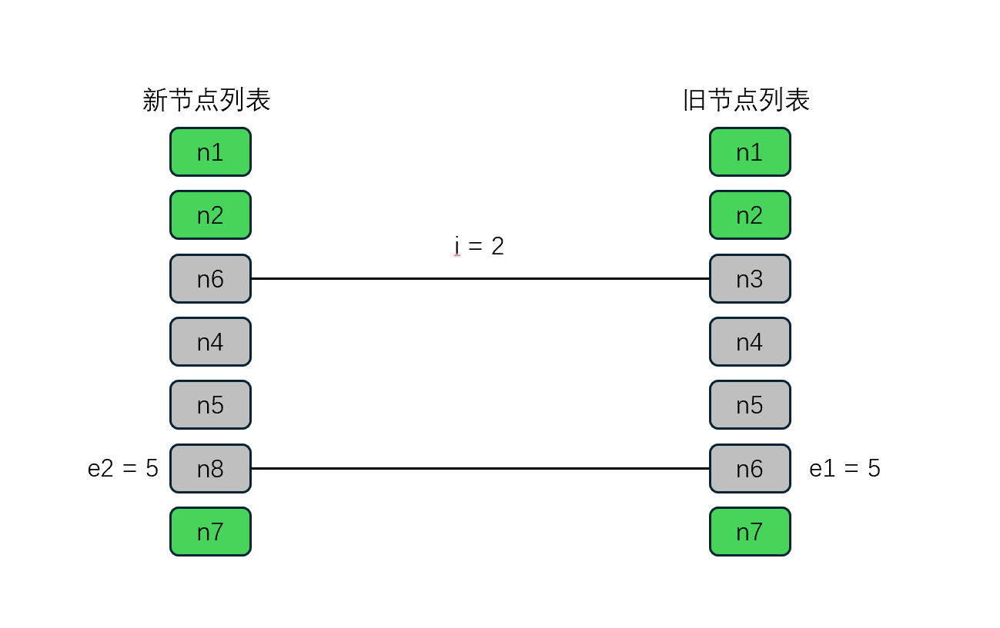

- 🙂‍↕️ 处理仅有新增节点

  旧节点遍历完 -> 新增新节点

  ```typescript
  if (i > e1) {
    if (i <= e2) {
      // 找到插入锚点（保证插入顺序正确）
      const nextPos = e2 + 1
      const anchor = nextPos < l2 ? c2[nextPos].el : parentAnchor
      // 批量新增新节点
      while (i <= e2) {
        patch(null, c2[i], container, anchor)
        i++
      }
    }
  }
  ```

  如图所示

  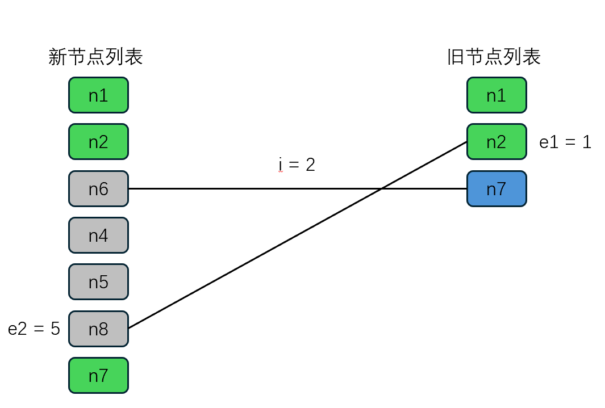

- 🙂‍↕️ 处理仅有卸载节点

  `i > e2`（新节点没了，旧节点有多余）-> 删除多余旧节点

  ```typescript
  else if (i > e2) {
    // 批量删除旧节点
    while (i <= e1) {
      unmount(c1[i])
      i++
    }
  }
  ```

  如图所示

  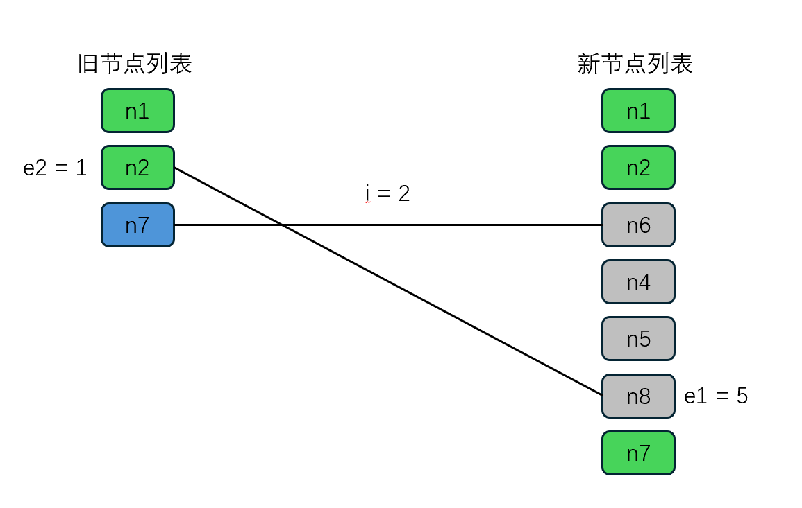

- 🙂‍↕️ 处理**其他**情况(新增/卸载/移动混合的复杂情况)

  - 情况提要
  
    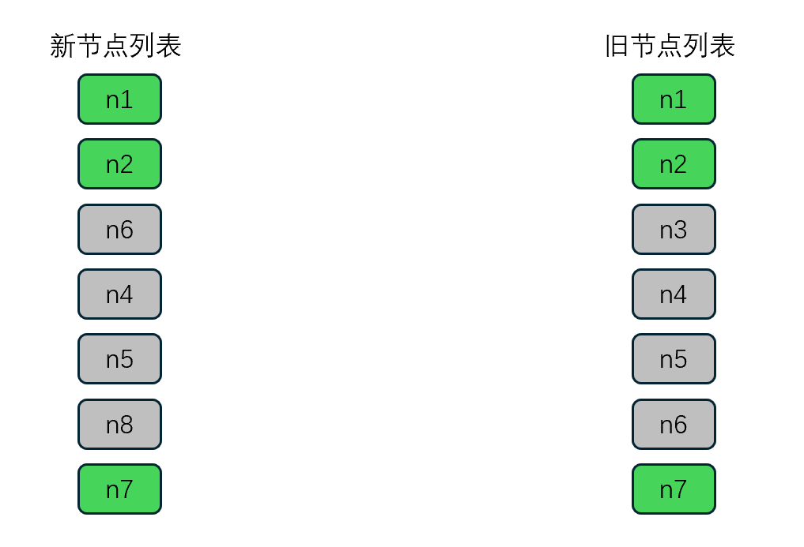
  
    如图，列表更新需要新增`n8`节点，删除`n3`节点，同时更新`n4` `n5` `n6` 的位置，Vue是如何高效处理这一流程的呢
  
  - **第一步**: 定义s1，s2变量，分别记录新旧节点需要处理部分的起始位置；并构建新节点位置映射表，用于映射出新节点与位置的索引关系。
  
    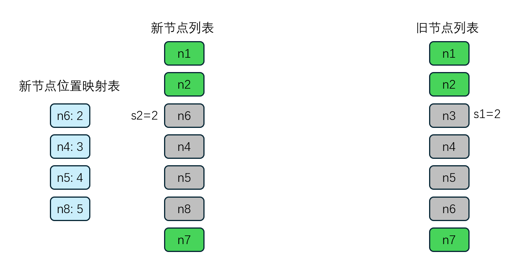
  
    ```typescript
    const s1 = i // prev starting index
    const s2 = i // next starting index
    
    // 5.1 build key:index map for newChildren
    // 5.1 为新的节点，构建一个 key:index 映射表 目的是快速定位key在数组中的位置
    // Map({d: 2, e: 3, c: 4, h: 5})
    const keyToNewIndexMap: Map<PropertyKey, number> = new Map()
    for (i = s2; i <= e2; i++) {
      const nextChild = (c2[i] = optimized
        ? cloneIfMounted(c2[i] as VNode)
        : normalizeVNode(c2[i]))
      if (nextChild.key != null) {
        if (__DEV__ && keyToNewIndexMap.has(nextChild.key)) {
          warn(
            `Duplicate keys found during update:`,                      					 JSON.stringify(nextChild.key),
            `Make sure keys are unique.`,
          )
        }
        keyToNewIndexMap.set(nextChild.key, i)
      }
    }
    ```
  
  - **第二步**: 定义两个变量(当前最远位置、移动标识)，构建新旧节点位置映射表，用于记录新旧节点位置的映射关系
  
    当前最远位置: 用于记录新节点中当前的最远位置: 目的是判断新旧节点在遍历的过程中是否同时呈现递增趋势，如果不是则证明节点产生了移动，需要移动标识置为true，后续进行移动处理；
  
    新旧节点位置映射表(数组): 初始值均为0，如果处理过后都是还是保持0这个值的话，则判定新节点，后续需要挂载。
  
    ```typescript
    // 遍历旧节点
    let j
    let patched = 0 // 记录已经处理的节点数量
    const toBePatched = e2 - s2 + 1 // 记录需要处理的节点数量
    let moved = false // 记录是否需要移动节点
    // used to track whether any node has moved
    let maxNewIndexSoFar = 0 // 记录最新节点的位置，判断是否移动
    // works as Map<newIndex, oldIndex>
    // Note that oldIndex is offset by +1
    // and oldIndex = 0 is a special value indicating the new node has
    // no corresponding old node.
    // used for determining longest stable subsequence
    const newIndexToOldIndexMap = new Array(toBePatched)
    // 遍历 toBePatched 并且初始化为 0
    for (i = 0; i < toBePatched; i++) newIndexToOldIndexMap[i] = 0
    ```
  
  - **第三步**: 开始填充新旧节点映射表
  
    1. 从s1 = 2 开始，遍历旧节点列表，当s1 = 2 时对应 n3 节点，我们从新节点映射表中寻找，发现没有找到，所以判定该节点为需要卸载的节点，直接执行卸载操作
  
       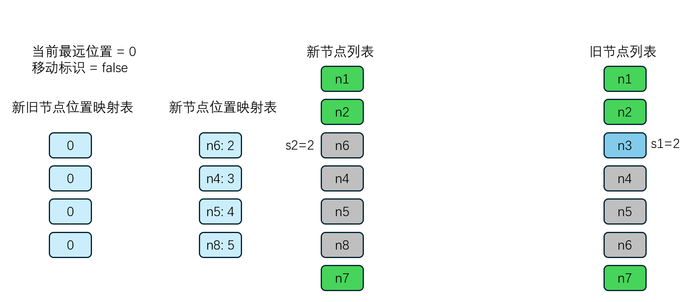
  
    2. 当 s1 = 3 时，对应n4节点，我们从新节点位置映射表中寻找，发现可以找到，就把s1的值 + 1后得到4存到新旧节点位置映射表中，同时我们对比新节点位置索引值(3)和当前最远位置，发现新节点位置索引值要大，所以把3记录到当前最远位置中，最后打补丁patch(只是更新内容，位置不变哦)。
  
       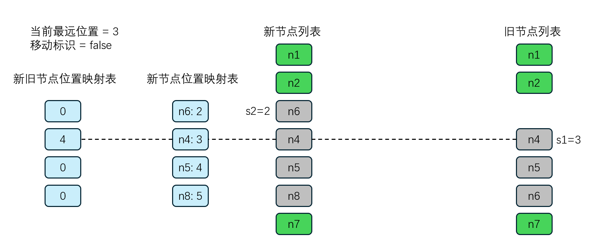
  
    3. 当s1 = 4 时，对应n5节点，我们从新节点位置映射表中寻找，发现可以找到，就把s1的值 +1后得到 5存到新旧节点位置映射表中，同时我们对比新节点位置索引值(4)和当前最远位置，发现新节点位置索引值要大，所以把4记录到当前最远位置中，最后打补丁patch。
  
       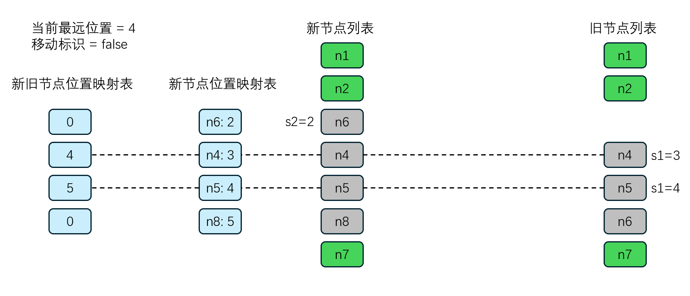
  
    4. 当s1 = 5 时，对应n6节点，我们从新节点位置映射表中寻找，发现可以找到，就把s1的值 +1后得到 6存到新旧节点位置映射表中，同时我们对比新节点位置索引值(2)和当前最远位置，发现当前最远位置要大，不是呈递增趋势了，说明在对比的过程中，发现了节点需要移动的情况所以我们把移动标识变为true，最后打补丁patch
  
       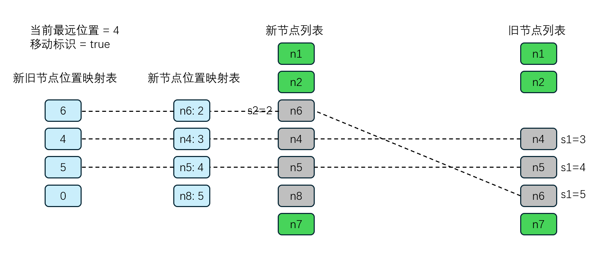
  
    ```typescript
    // 遍历旧节点 [c, d, e]
    for (i = s1; i <= e1; i++) {
      const prevChild = c1[i]
      // 如果patched 大于等于 toBePatched 说明新节点遍历完了，旧节点还有剩余，则卸载旧节点
      if (patched >= toBePatched) {
        // all new children have been patched so this can only be a removal
        unmount(prevChild, parentComponent, parentSuspense, true)
        continue
      }
      let newIndex
      if (prevChild.key != null) {
        newIndex = keyToNewIndexMap.get(prevChild.key)
      } else {
        // key-less node, try to locate a key-less node of the same type
        for (j = s2; j <= e2; j++) {
          if (
            newIndexToOldIndexMap[j - s2] === 0 &&
            isSameVNodeType(prevChild, c2[j] as VNode)
          ) {
            newIndex = j
            break
          }
        }
      }
      if (newIndex === undefined) {
        // 没有找到对应的新节点，卸载旧节点
        unmount(prevChild, parentComponent, parentSuspense, true)
      } else {
        newIndexToOldIndexMap[newIndex - s2] = i + 1
        if (newIndex >= maxNewIndexSoFar) {
          // 新节点的索引大于等于 maxNewIndexSoFar 说明新节点在旧节点的后面，不需要移动
          maxNewIndexSoFar = newIndex
        } else {
          // 新节点的索引小于 maxNewIndexSoFar 说明新节点在旧节点的前面，需要移动
          moved = true
        }
        patch(
          prevChild,
          c2[newIndex] as VNode,
          container,
          null,
          parentComponent,
          parentSuspense,
          namespace,
          slotScopeIds,
          optimized,
        )
        patched++
      }
    }
    ```
  
  - **第四步**: 处理新旧节点位置映射表
  
    1. 首先，需要从里面去寻找出一个**最长递增子序列**，目的是让节点可以做到最小限度的移动操作，在例子中，我们可以发现最长递增子序列是4，5，我们需要把他们的位置索引值记录下来，也就是1，2。
  
       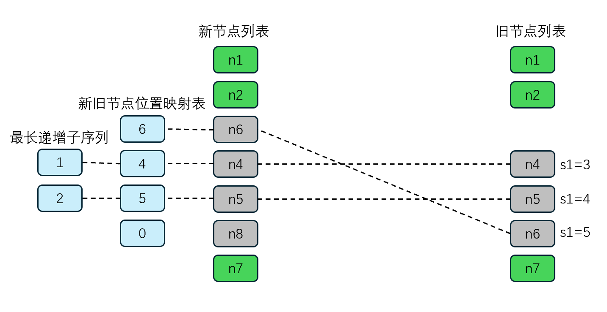
  
    2. 然后从后开始往前遍历，处理新旧节点位置映射表，定义变量i记录位置，同时定义变量j记录最长子序列的位置，初始化为1，当i = 3时，位置值为0，对应节点是n8，新旧节点映射表中值为0则说明要新增，直接挂载就可以了
  
       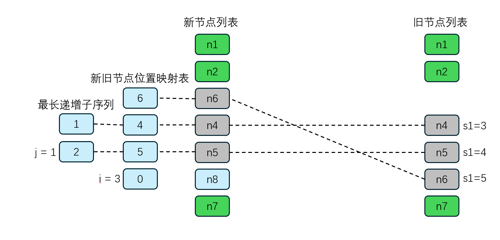
  
    3. 当i = 2时，位置值为5，对应节点为n5，i = 2 它是处于最长递增子序列j=1的地方的，因此无需移动直接跳过，一旦找到最长递增序列的元素，i 和 j需要同时往上移动。
  
       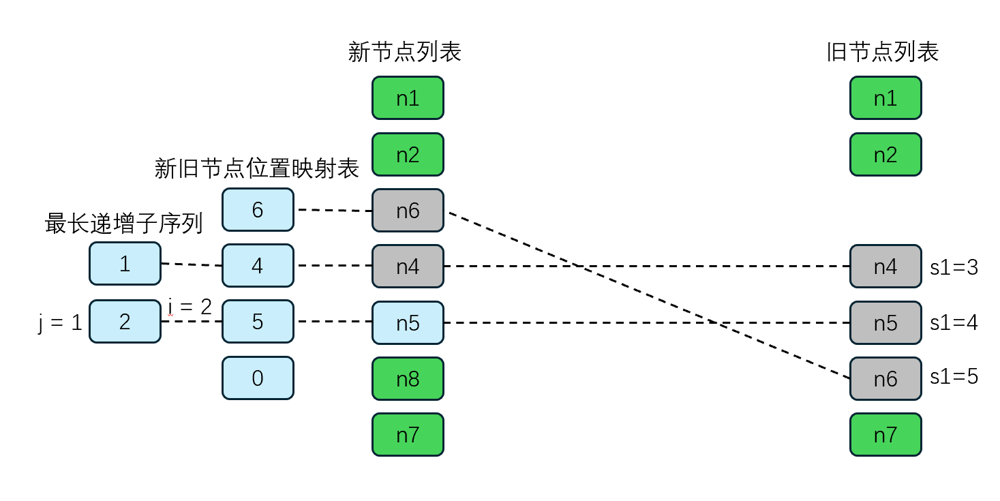
  
    4. 当 i = 1 时，位置值为4，对应节点为n4，i = 1 它是处于最长递增子序列 j = 0 的地方的，因此无需移动直接跳过，i = 1 继续向上移动。
  
       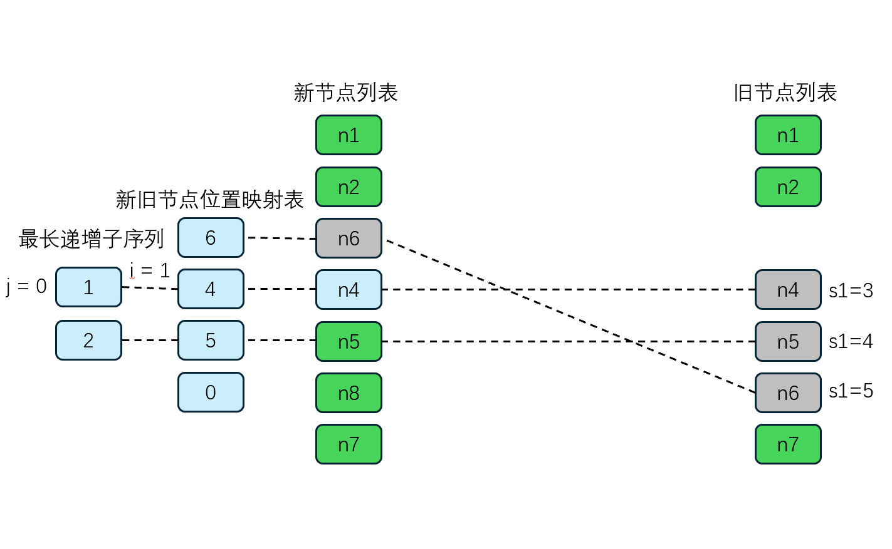
  
    5. 当 i = 0 时，位置值为6，对应节点为n6，i = 0它不处于最长递增值序列中，因此该节点需要移动，我们就执行移动操作。
  
       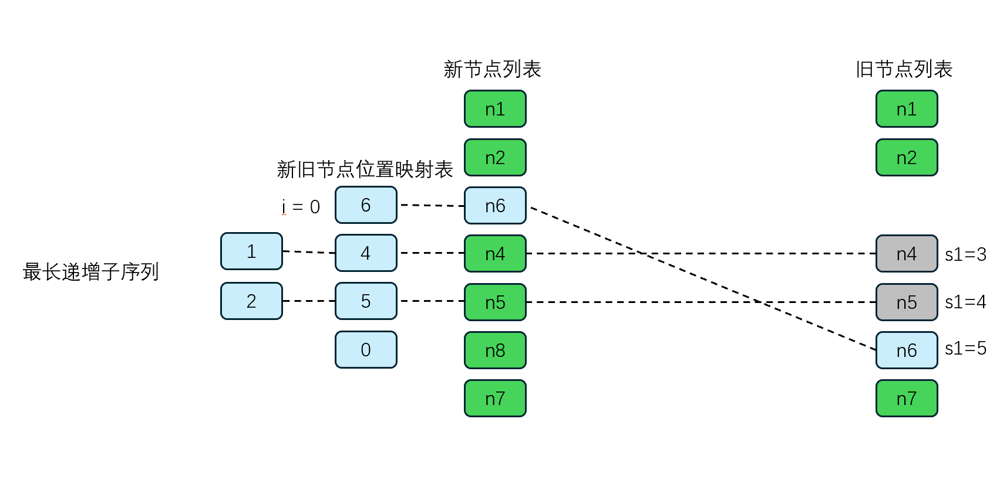
  
- 到这里，Vue有key的diff算法就完成了🐶

